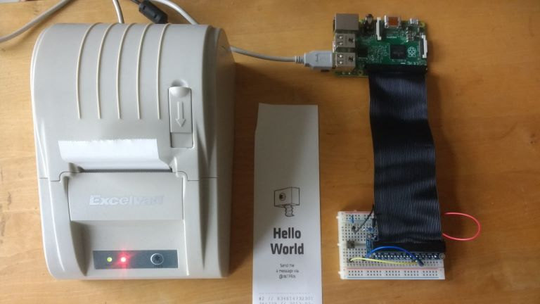
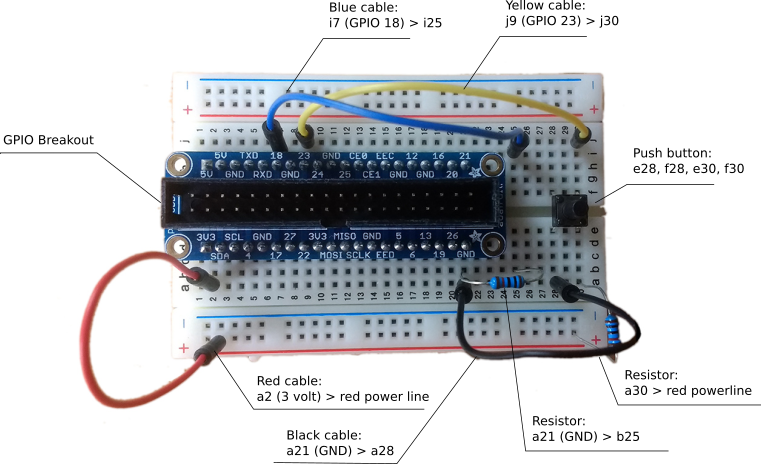

# Hardware assembly

As part of the [INTPRN](/INTPRN/) project, we document here the  components for a basic setup and their assembly. Other parts of the 
project are [a software script](https://github.com/ut/PRNSTN) to run a print station and the physical construction of a box for outdoor use.

## Components

* Thermal Printer, Model ZJ-5890T (194mm L x 133mm B x 144mm H)
* Raspberry Pi 2 Version B w/WLAN USB Stick and Raspian OS  ( 88mm + 12mm WLAN USB Stick = 100m L x 60mm B x 20mm H)
* GPIO Breakout (e.g. Adafruit Assembled Pi Cobbler Plus Breakout Cable)
* Push button  (e.g. Conrad Drucktaster T604 = TS695)
* 1k and 10k ohm resitors
* Breadboard (e.g. Breadboard 400(300/100))
* Cables
* Thermalpaper 58mm x 50m 

Pay attention, thermalpaper normally is made with [BPA](https://en.wikipedia.org/wiki/Bisphenol_A). There is some "[concern about the potential hazards of endocrine-disrupting chemicals - including BPA](https://en.wikipedia.org/wiki/Bisphenol_A#cite_note-endosoc-53)". Better check out for BPA-free thermalpaper.

## Controller

See [Raspberry Pi Setup](controller.html)

## Assemble the breadboard

See the tutorial in [Raspberry Pi Workshop: 10. Push Buttons](http://workshop.raspberrypiaustralia.com/button/2014/08/31/10-push-buttons/), which we used as a reference for our setup (Thanks to the authors Marcus Schappi and Justy Clayden). Or check a slightly different setup at [Raspberry Pi: Button-Input (Taster)](https://raspuino.wordpress.com/2014/03/26/raspberry-pi-button-input-taster/) (german)

## Connect the breadboard with the Raspberry PI

(Pending)

## Test the setup w/Ruby

(Pending)

